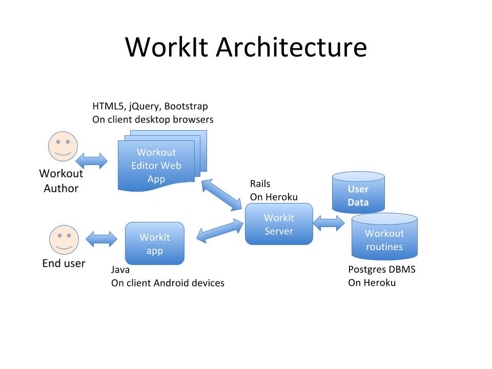
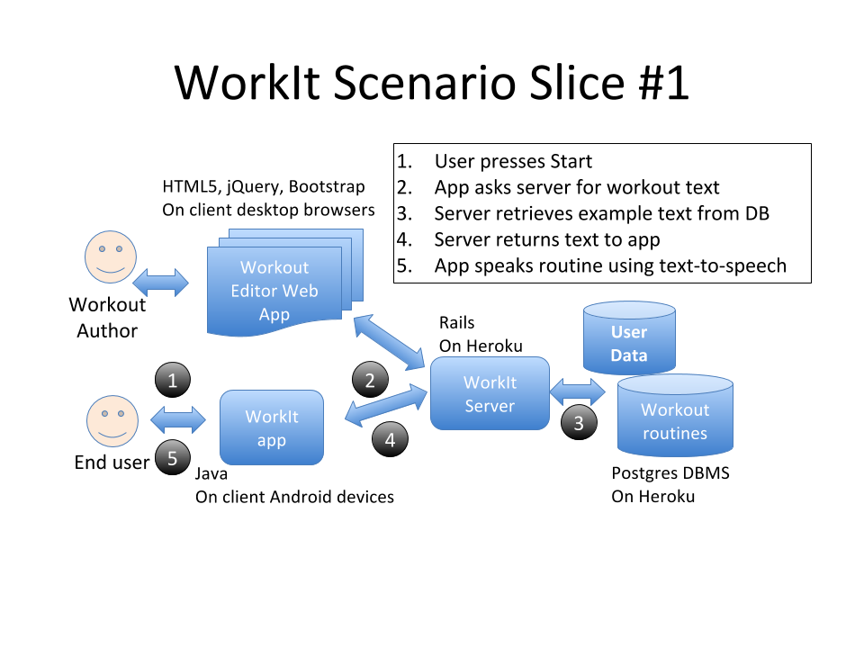

# Development Environment Assumptions
## Diagram of Overall Architecture
In this section draw a diagram describing the pieces of the overall system.   For example, if the product is a website, it would show which web server, what language the website is written in (e.g. PHP).   Whether a database is used to back the web pages (e.g. MYSQL).   If the website is accessed via a browser, indicate that on the diagram.   If the intention is to use embellished pages with JavaScript and CSS; indicate whether any frameworks are to be used; or protocols that will be used between page and server.   For mobile applications, indicate the target mobile clients.   For example, if the product is an iPhone application that connects to a website; indicate that, including the current thinking around the mechanism for communicating between the client and the server.

See help for inserting a diagram of the architecture.  Example: 
### Work-it Architecture

### Work-it Slice

## Description of Client / User Interface Environment
For a mobile application, describe the environment needed, e.g. a web browser supporting html 5; or that you are building a native objective C app for the iPhone; or in the web case which browsers frameworks like jQuery or AngularJS are being targeted
## Local Data Requirements
Will data be stored on the client? For example, in the mobile case, is data stored offline.   What format will it be stored in?

## Communication between client and web server
What is the expectation around client/server communication? Is it simply http accessing server generated web pages?  Is it an AJAX style application where a more sophisticated protocol is used from JavaScript to the server, REST? 
## Web server environment / language
For the logic tier of your application, what language or framework is it using (e.g. JavaScript, PHP, Ruby on rails, Java, Python, ASP)
## Data Requirements
How is data being stored for your application? A relational database like MYSQL? The file system?   A “NOSQL” system like mongo dB?
## 3rd Party APIs, legacy applications or web services used
If you intend to integrate with Facebook, you will use the Facebook API set.   For maps you may use google or Microsoft maps.   If you have payments you may use the PayPal API’s, etc.   Are there particular web services you will need to integrate with?

# Technical Hypothesis
##  Which parts of this architecture use technologies or techniques that are the biggest unknowns to the team
Potential unknowns:

1. technology new to the team(e.g. “we have never written an iPhone application before”). 
2. a new algorithm needs to be invented (e.g. building recommendations based on facebook profile info)
3. resource requirements unknown (e.g. how much time and space to digest the full twitter feed)

##  What technical “tests” will we do insure that this can work. 
The technical tests for architecture are sometimes called “[spikes]"(http://www.jamesshore.com/Agile-Book/spike_solutions.html)

Describe here what must the team test in order to reduce overall risk (e.g. for the examples above (1)  we will write an example application in objective c to show some initial progress, for (2) we generate some sample data and write a small program to generate recommendations (3) we will get a small amount of data from a known set of twitter accounts and understand the initial processing time and space.

Consider creating each technical spike description as a new wiki page describing what was tested and what the results were.
